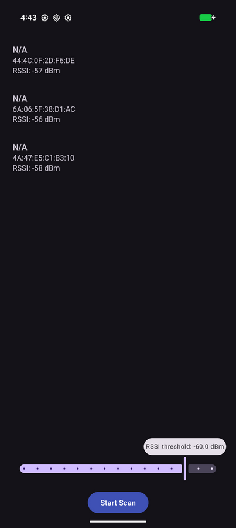
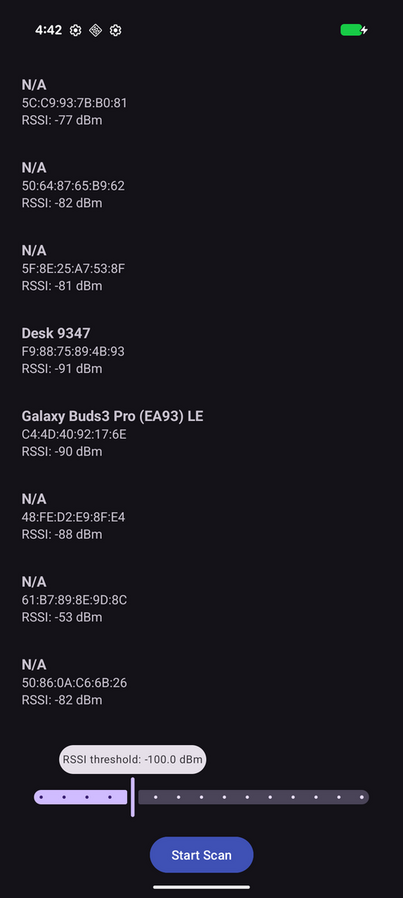

## Bluetooth Scanning App

## Purpose

This application serves as a basic tool for Bluetooth Low Energy (BLE) scanning functionality on Android. It allows users to quickly initiate a scan and view nearby devices along with their signal strength.

## Screenshots




## Features

* **Scan Initiation**: Upon granting necessary permissions, the user can start scanning for BLE devices.
* **Device List Display**: Discovered devices are displayed in a simple list format. Each entry shows:
    * Device Name (if available) or MAC Address
    * RSSI (Received Signal Strength Indicator)
* **RSSI Filter**: A slider allows users to filter displayed devices based on their RSSI values. The filter range is currently set from -100 dBm to -50 dBm.
  > **Note:** The effective range of RSSI can vary greatly depending on the environment and hardware.

## Usage

1.  **Launch the app.**
2.  **Grant Permissions**: If prompted, accept the required permissions for Bluetooth scanning (e.g., `BLUETOOTH_SCAN`, `ACCESS_FINE_LOCATION`).
3.  **Observe Scan Results**: The app will begin scanning, and devices will appear in the list.
4.  **Filter by RSSI (Optional)**: Adjust the slider to configure the signal strength scan filter. Devices with RSSI values below the selected slider value will be shown.
    > **Note:** The user must restart the scan once again as the scanning will stop automatically when the slider is moved.

### Build

1.  **Build the app:**
    ```
    m ScanningApp
    ```
2.  **Install the app:**
    ```
    adb install -r ${ANDROID_PRODUCT_OUT}/system/app/ScanningApp/ScanningApp.apk
    ```
3.  **Launch the app.**
